AOI
---

AOI is the area of interest and stores and manages all AOIs you upload or download. AOI can be used in tools: raster clip, vector clip and training tool. 
Users can easily find their available AOIs by searching the name of AOI.

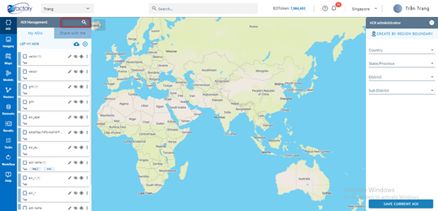

My AOIs
=======

Tab My AOIs show all the owner’s AOIs 

Created
*******

There are 4 ways to create new AOI: Draw on Map, Upload file, Drag and drop and Using the region boundary

* Draw on map

Step 1: Click icon below

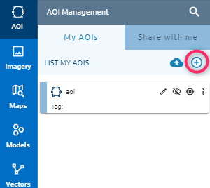

Step 2: Click icon Draw tool to select tool

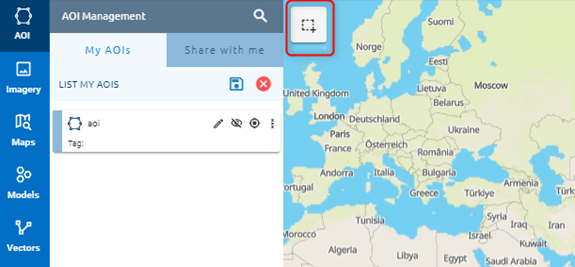

Click or use shortcut (3 for Draw polygon, 4 for Draw rectangle, 5 for Draw assist rectangle, 6 for Draw circle) to select tool

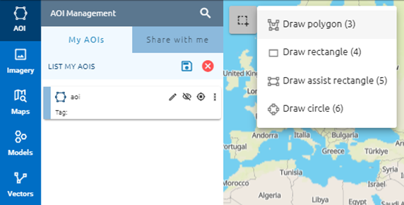

Step 3: Use selected tool to draw AOI on map

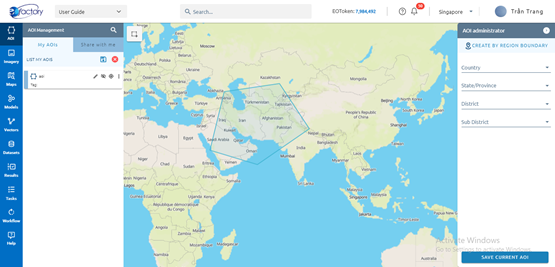

Step 4: Click icon Save:

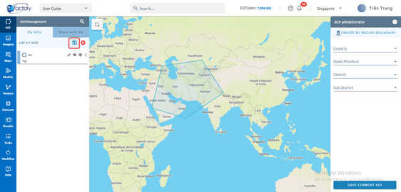

or Save Current AOI button

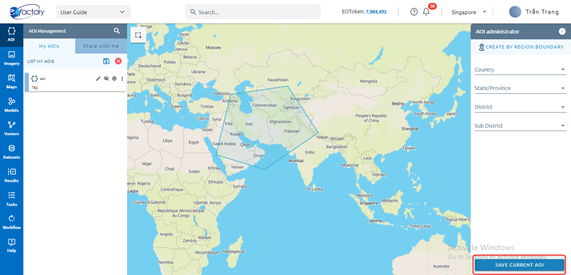

Step 5: Type AOI name

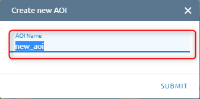

Step 6: Click Submit button

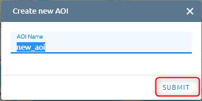

* Upload file: by browse or drag/drop file into map

Step 1: Click icon Upload AOI

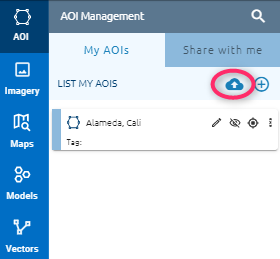

A popup will appear

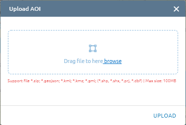

Step 2: Click dropbox -> Select file from PC or Drag and drop file into dropbox (System support file: .zip, geojson, .kml, .kmz, .gml , .shp (.shp, shx, prj, .dbf)). 

If not .shp file, only select one file:

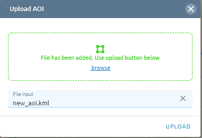

Else, select four files: .shp, .shx, .prj, .dbf:

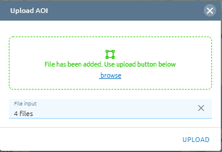

Step 3: Click Upload button

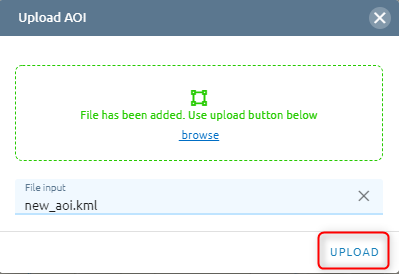

New AOI is created

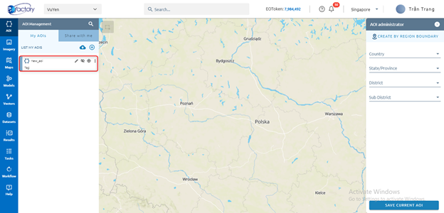

* Drag and drop file into map

Step 1: Select file from PC

Step 2: Drag and drop into map

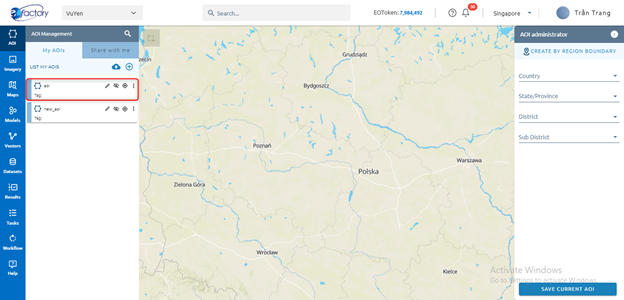

* Create by region boundary

Step 1: Select region boundary

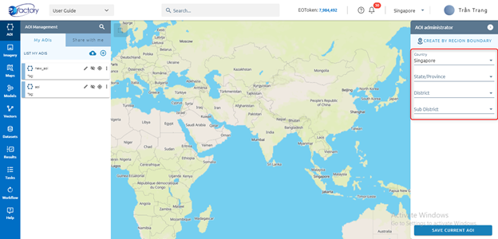

You can select one or many boundaries.

If select many boundaries, please choose UNION or CONCAVE HULL

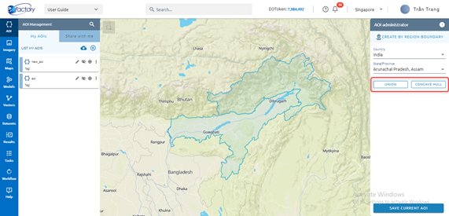

Step 2: Click Save Current AOI button

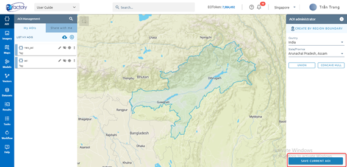

Info
****

User want to see info of AOI

Click menu icon -> Click Info button

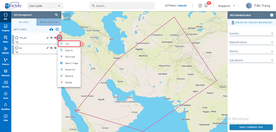

Edit
****

User want to edit existed AOI

Step 1: Click pen icon of AOI you want edit

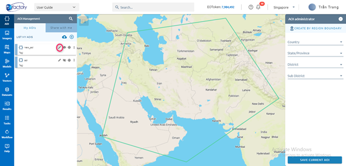

Step 2: Click AOI on map -> Edit

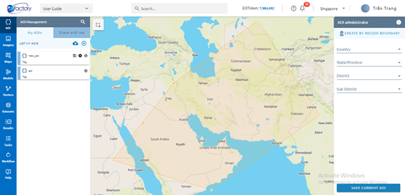

Step 3: Click Save icon

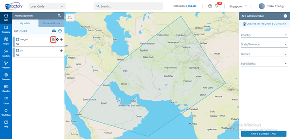

Click Update button to confirm change

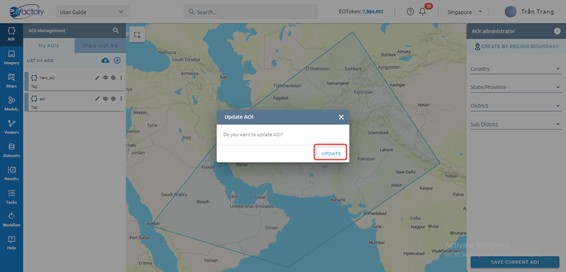

Copy
****

User want  copy AOI to other workspace

Step 1: Click menu icon of AOI -> Copy to

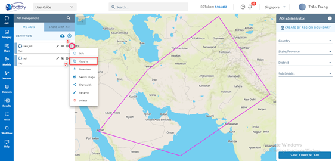

Step 2: Select workspace which you want copy to

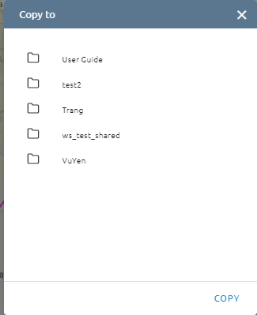

Step 3: Click Copy button 

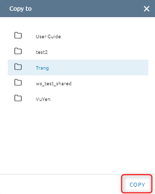

=> AOI is copied to the workspace “Trang”. Open workspace to check.

Download
********

Select AOI which you want to download: Click menu icon -> Click download button. 

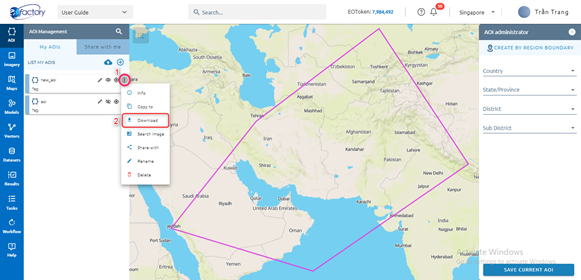

=> File is saved as .geojson. File name is AOI’s name.

Search in Image
***************

User want to use AOI to search image

and the display to search image appear:

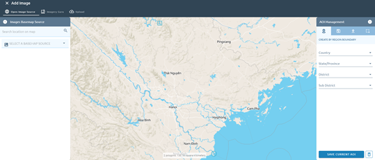

Share
*****

User want share AOI to other user with email

Step 1: Click menu icon -> Click Share with button

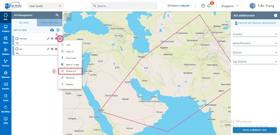

Step 2: Type email

You can share to multi different email:
* Type email
* Press Enter in keyboard

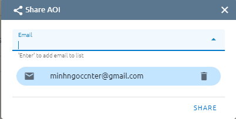

Step 3: Click Share button

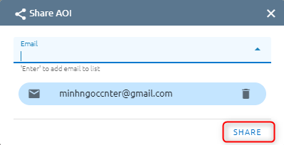

=> AOI is shared to other user

Rename
******

User want to rename AOI

Step 1: Click menu icon -> Click Rename button

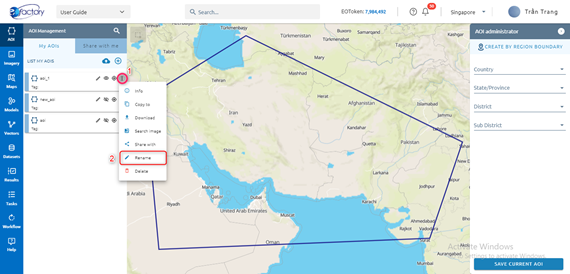

Step 2: Type new name and add tag or not (Add tag: Type tag -> Enter). 

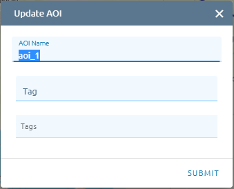

Step 3: Click Submit button

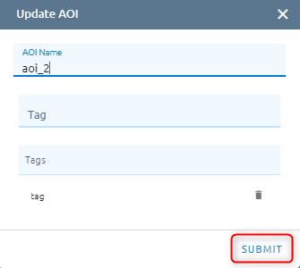

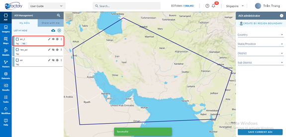

=> AOI is renamed and add tag

Delete
******

Users want to delete AOI.

Step 1: Click menu icon -> Click Delete button

Step 2: Click confirm button

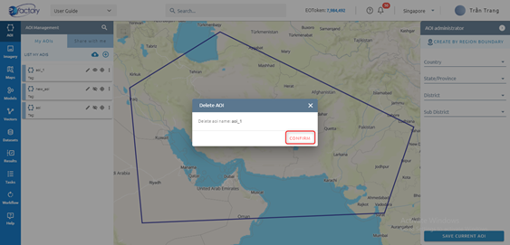

Shared with me
==============

Tab Share with me show  list AOIs which others shared with the user. To use the AOIs, user need to make copy to my AOI

Make copy
*********

User want copy AOI to my AOI

Step 1: Click menu icon -> Click Make copy button

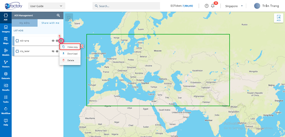

Step 2: Type name

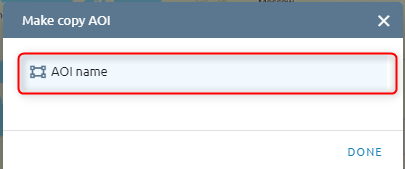

Step 3: Click Done button

Download
********

User want to download shared AOI

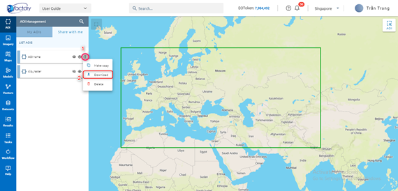

=> AOI is downloaded and saved as .geojson, file name is AOI name.

Delete
******

User want delete shared AOI

Click menu icon -> Click Delete button

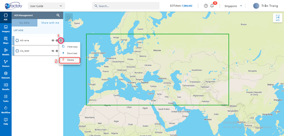

Click Confirm button to delete

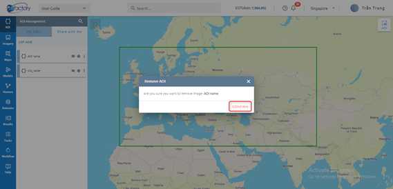

