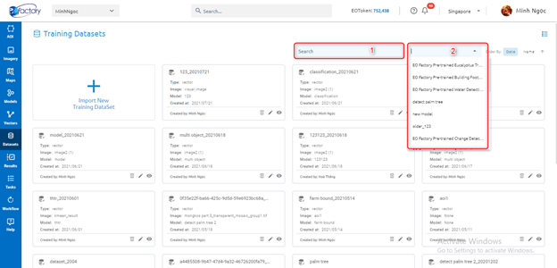
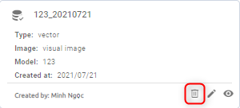

Dataset
-------

Where storing and managing the datasets. You can order by date, name of datasets.

Search
======

Allow search datasets by name (1), model (2):

Import New Training Dataset
===========================

Step 1: Click Import new training dataset to show popup

Step 2: Type input

Require: Select image or AOI.

(1): Type dataset name

(2): Select date

(3): Select Category

(4): Select image from images list

Step 3: Click Search button

Step 4: Select dataset -> Click Clip or Scene button to download dataset

Type dataset name -> Click Download button

=> New training dataset is created.

Edit
====

Click ??? icon or click right mouse -> click Edit button on each dataset. Then update input

.. image:: ./img/edit_dataset_1.png

Step 1: Type input

(1): Type dataset name

(2): Select image from images list

(3): Edit layers:

* Click ??? icon to Zoom to
* Click ??? icon to Edit

(4): Add tag

Step 2: Click Update button

Add to map
==========

Click icon or click right mouse -> click Add to map button to add to map: show all layer of dataset

.. image:: ./img/add_map_dataset_1.png

Delete
======

Click icon or click right mouse -> click Delete button:

After clicking the Confirm button to delete.
