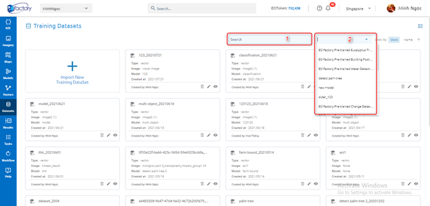
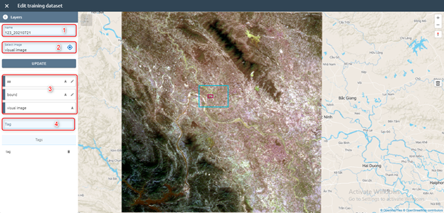
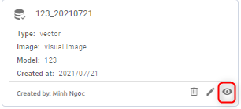
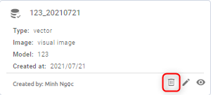

Base Features
-------------

Search
======

Allow search datasets by name (1), model (2):

Edit
====

Click pen cil icon or click right mouse -> click Edit button on each dataset. Then update input

Step 1: Type input

1. Type dataset name
2. Select image from images list
3. Edit layers:

   * Click ??? icon to Zoom to
   * Click ??? icon to Edit

4. Add tag

Step 2: Click Update button

Add to map
==========

Click icon or click right mouse -> click Add to map button to add to map: show all layer of dataset

Delete
======

Click icon or click right mouse -> click Delete button:

After clicking the Confirm button to delete.