Imagery
-------

Imagery where store and manage the images and the raster resuls. Also in Imagery, users can upload images, or download satellite images such as: Sentinel, Landsat or even add their own URL to download images. Besides storing and managing images, Imagery provides the toolkits to let users analyse the images.

Add
===

There are several ways to add images in Imagery: download satellite images such as Landsat, Sentinel, use Imagery Guru to search for images, or upload directly from PC. 

.. image:: ./img/imagery.png

(1): Open Image Source: Download image from free sources (Sentinel1, Sentinel2, Rolodex, Landsat-8, Bing, DEM)

(2): Imagery Guru: 

(3): Upload: Upload file from PC

Open Image source
*****************

Users can download images from free sources: Sentinel 1, Sentinel 2, Landsat-8, Bing, SRTM(DEM), Rolodex.

Click Select A Basemap Source to select source:

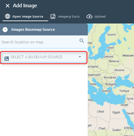
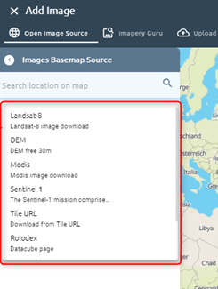

* Sentinel 1

Step 1: Select date, orbit direction:

Choose one of two options above

Step 2: Select AOI:

There are four ways to select AOI:

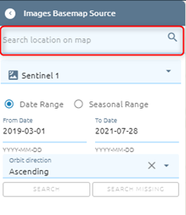

Use Draw tool to draw AOI on map: Click ??? icon -> Select one of four tools by click or use shortcut:

.. image:: ./img/image_source_sen1_2.png

.. image:: ./img/image_source_sen1_2.png

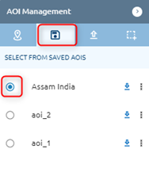

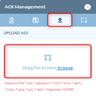

Step 3: Click Search button and select items

.. image:: ./img/image_source_sen1_5.png

Default: each area chooses one item.

Click the checkbox Select all images to select all images.

Click ???  icon to show all items in that area

.. image:: ./img/image_source_sen1_6.png

Step 4: Click Clip or Scene

(Clip:) the image will be downloaded and clipped with AOI

(Scene:) Image will be download whole scene

.. image:: ./img/image_source_sen1_7.png

 Step 5: Select product (can choose many), type name

.. image:: ./img/image_source_sen1_8.png
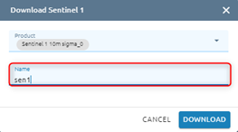

Step 6: Click Download button

.. image:: ./img/image_source_sen1_10.png

=>  Task will be created in Tasks, wait task success, check result in Imagery

* Sentinel2

Similar to download sentinel 1, but download sentinel 2 does not have orbit direction, it is replaced by Percent cloud.

Step 1: Select date, type percent cloud (default: 40)

Step 2: Select AOI

Step 3: Click Search button and select items

Step 4: Click Clip or Scene (which clip means the image will be downloaded and clipped with AOI. Scene means that Image will be download whole scene)

Step 5: Type name and select option (R10M or R20M, L1C or L2A, Haze Remove or not Haze Remove)

.. image:: ./img/image_source_sen2_1.png

Step 6: Click Download button

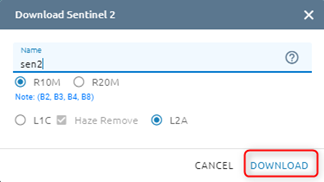

You can choose one, many or all images to download

.. image:: ./img/image_source_sen2_3.png

=>  Task will be created in Tasks, wait task success, check result in Imagery

* Landsat-8

Step 1: Select date, type percent cloud (default: 40)

Step 2: Select AOI

Step 3: Click Search button and select items

Step 4: Click Clip or Scene (which clip means the image will be downloaded and clipped with AOI. Scene means that Image will be download whole scene)

Step 5: Type name, select option (Haze remove or not Haze remove, 4 bands or all)

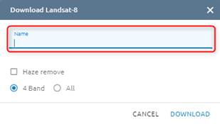

Step 6: Click Download button

.. image:: ./img/image_source_landsat8_2.png

=>  Task will be created in Tasks, wait task success, check result in Imagery

* Bing

With Bing, you just need to choose AOI

Step 1: Select AOI

Step 2: Click Download button

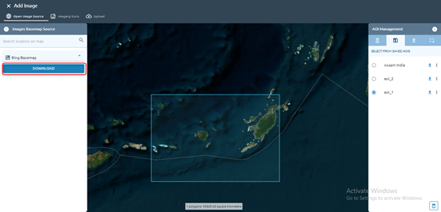

Step 3: Type name -> Click Submit button

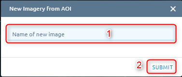

=>  Task will be created in Tasks, wait task success, check result in Imagery

* SRTM (DEM)

Similar to Bing, you just need to choose AOI.

Step 1: Select AOI

Step 2: Click Download button

Step 3: Type name -> Click Submit button

* Rolodex

Step 1: Select type image, date

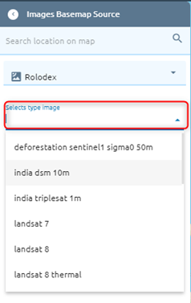

Step 2: Select AOI

Step 3: Click Search button -> Select item(s)

Step 4: Click Clip or Scene

Step 5: Type name, select “Would you like to mosaic?” to mosaic if there are many items (if checked, you can type resolution) 

.. image:: ./img/image_source_rolodex_2.png
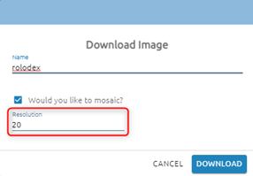

Step 6: Click Download button

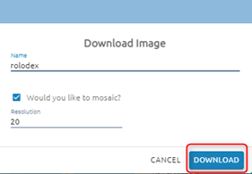

=>  Task will be created in Tasks, wait task success, check result in Imagery

Imagery Guru
************

Download the commercial images

?????

Upload
******

Users want to upload files from the computer. System support file .tiff, .tif, .zip

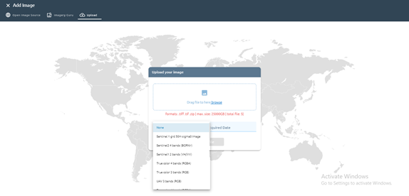

Click Upload File button 

After clicking the button, a task will be created. Task success -> uploaded image successful.

=> Please check at tab My Images.

Tools for Managing Image
=========================

Information of Image
********************

User want to see information of image

There are three ways:

* Click info icon directly on image:

.. image:: ./img/info_image_1.png

Show info image popup. If you want see more info, please click Show More Info button

* Click right mouse on image -> click info button

.. image:: ./img/info_image_4.png

* Click image -> click ???  icon on toolbar -> click Info button

.. image:: ./img/toolbar.png

View in Map
***********

Users want to view images on Map.

There are two ways similar to Info:

* Click icon direct on image

.. image:: ./img/add_map_image_1.png

* Click right mouse on image -> click Add to map button

.. image:: ./img/add_map_image_2.png

After click icon, page will redirect to Maps

Share
*****

Users want to share images with other users by using their emails. You can share with one or many people.

There are two ways:

* Click  image -> click ???  icon on toolbar

.. image:: ./img/share_image_1.png

Then a popup appears, please type email -> Click Share button. If you want share to multi email, type one email -> Enter: 

.. image:: ./img/share_image_2.png

* Click right mouse on image -> Click Share with button

Then similar to the above way.

Edit
****

Users want to edit images.

There are two ways:

* Click right mouse on image -> Click Edit button

* Click image -> Click ???  icon -> Click Edit button

Move
****

Users want to Move image to another folder (or root) in the current workspace.

Click right mouse -> Click Move to button

Select existed folder -> Click Move here button:

.. image:: ./img/move_image_2.png

or Create new folder -> Select that folder -> Click Move here button:

.. image:: ./img/move_image_3.png

=> Please open the selected folder to check. 

Download
********

Users want to download images to the computer.

There are three ways similar to Info:

* Click download icon directly on image

.. image:: ./img/download_image_1.png

* Click right mouse on image -> click Download button

* Click image -> click ???  icon on toolbar -> click Download button

.. image:: ./img/download_image_3.png

After download success, file name is image name, file format is .tif.
In addition, images with raw files, such as landsat/ sentinel, users can download raw data by using the Info -> click download icon in image detail. File raw download will be downloaded with format *.zip.

.. image:: ./img/download_image_4.png

Copy
****

Users want to copy images to other workspaces.

There are two ways:

* Click right mouse -> Click “Copy to” button

Show list workspace popup -> Select workspace you want to move to -> Click Copy button.

If you want to move to a folder in that workspace, select existing folder (1) or create new folder (1’) -> Select created folder -> Click Copy button.

.. image:: ./img/copy_image_2.png

* Click image -> Click ???  icon on image

.. image:: ./img/copy_image_4.png

Delete 
******

Users want to delete images.

There are two ways:

* Click image -> click ???  icon on toolbar

.. image:: ./img/delete_image_1.png

* Click right mouse on image -> click Delete button

.. image:: ./img/delete_image_2.png

Toolbar for Analysis
=====================

Basic toolkit: mosaic tool, reclass toolset and tools 

.. image:: ./img/toolbar_analysis.png

Mosaic Tool 
***********

This tool allows the user to mosaic by manually choosing cutlines between images before mosaicing. 

Click ???  icon on toolbar to start use tool:

.. image:: ./img/mosaic_manual_tool.png

?????

Reclass Toolset
***************

Reclass toolset will reclassify (or change) the value in a raster- a range of value pixels will be reclassified or a single pixel (unique) will be assigned to another value.

You can choose image first, then click   icon or click  icon, then select image.

* Choose image -> Click   icon:

Step 1: Select band (Only one, you can search if there are many bands)

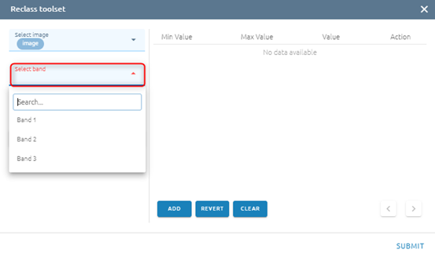

Step 2: Click Classify button

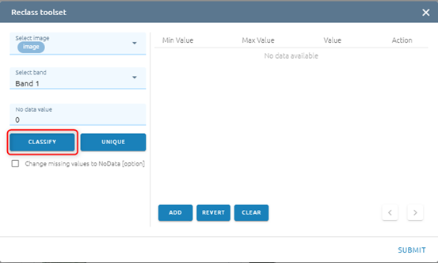

Step 3: Type input:

* Select mode

 ○	Standard Deviation: the method shows you how much a feature’s attribute value varies from mean. Class breaks are created with equal value ranges that percentage of the standard deviation using mean value and the standard deviation from the mean

 ○	Equal interval: the method divides the range of values into equal-sized subranges.

 ○	Quantile: the method will assign the same number of values to each class. There are no empty classes or classes with too few or too many values. This method works well with the linearly distributed data.

* Type Amount of value (If mode is Standard Deviation, the default Amount of value will be 6)

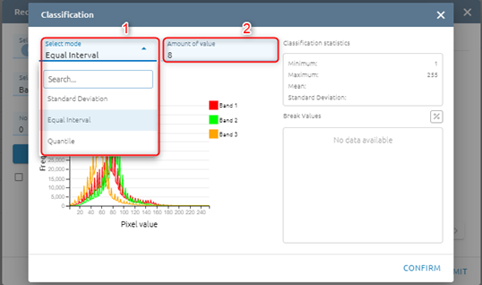

Step 4: Click Classify button

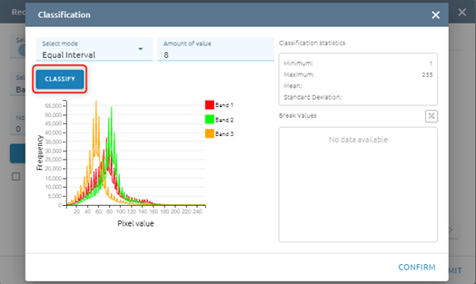

After click Classify button, please see Histogram and Break Values based mode and amount of value

.. image:: ./img/reclass_toolset_5.png

Step 5: Click Confirm button

.. image:: ./img/reclass_toolset_6.png

Step 6:

* You  can add Max value - Min value - Value

.. image:: ./img/reclass_toolset_7.png

Type new data

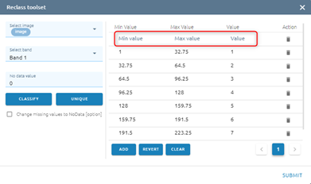

or you can edit by type directly

or delete by click  icon

* You can Revert values

.. image:: ./img/reclass_toolset_9.png
.. image:: ./img/reclass_toolset_10.png

* You can Clear all values

.. image:: ./img/reclass_toolset_11.png

* Default: No data value equal 0. If you want to change No data value, type input directly. And click checkbox if you want to change miss value to No data

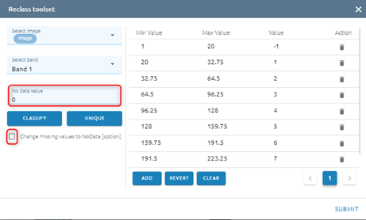

* Click Unique if you want each old value to correspond to a unique new value

.. image:: ./img/reclass_toolset_13.png

Step 7: Click Submit button

.. image:: ./img/reclass_toolset_14.png

Type name -> Click Confirm button

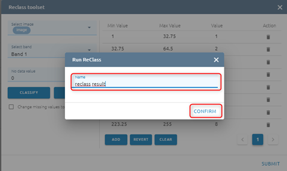

=> Tasks will be created in Tasks. Wait task was successful, please check at Imagery with the correct name.

Tools 
*****

?????

Advance Toolbar
===============

When users click on one image the advanced toolbar will appear instead of the basic toolbar. There are: copy to, mosaic tool, reclass toolset, raster calculator, tools, move selected images, share selected images and delete selected images. The ?copy to?, ?mosaic tool?, ?reclass toolset?, ?tools?,  ?move selected images?, ?share selected images? and ?delete selected images? are similar above.

.. image:: ./img/advance_toolbar.png

Raster Calculator
*****************

Raster Calculator is a tool to calculate raster pixel value. (if calculating in more than 2 rasters, they need to be same size matrix and same resolution)

Step 1: Click image -> Click ???  icon on toolbar

.. image:: ./img/raster_calculator_1.png

Step 2: Start to calculate on image: Select bands, operations.
Correspond to 3 operations: abs (absolute), sqrt (square root), con (conditional), will have suggestion

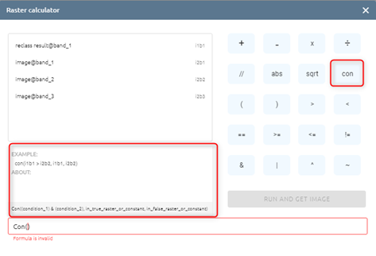

You can easily use the rest of the operations. 

Step 3: Click Run and get image button 

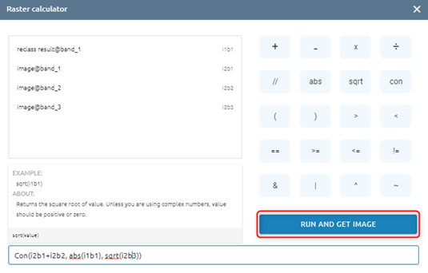

Step 4: 

* Type name
* Click  to create new folder -> select folder or select folder (skip create) 
* Click Save image button

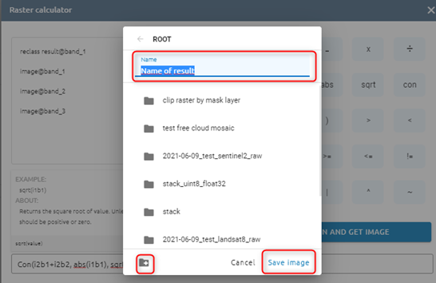

=> A task will be created in Tasks. Wait for the task to be successful, please check at Imagery with corrections.

Shared with me
==============

System store and manage shared images, folders.

Click Tab Shared with me

Copy 
****

There are two ways:

* Click  icon directly on image

Type name -> Click Done button

* Click right mouse on image -> Click Make copy button

Type name -> Click Done button

Delete 
******

There are two ways:

* Click   icon directly on image

Click Confirm button

* Click right mouse on image -> Click Remove button

Click Confirm button

View in Map
***********

There are two ways:

* Click   icon directly on image

* Click right mouse -> Click Add to map button

