Imagery where store and manage the images and the raster resuls. Also in Imagery, users can upload images, or download satellite images such as: Sentinel, Landsat or even add their own URL to download images. Besides storing and managing images, Imagery provides the toolkits to let users analyse the images.

Add
---

There are several ways to add images in Imagery: download satellite images such as Landsat, Sentinel, use Imagery Guru to search for images, or upload directly from PC. 

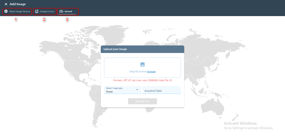

(1): Open Image Source: Download image from free sources (Sentinel1, Sentinel2, Rolodex, Landsat-8, Bing, DEM)

(2): Imagery Guru

(3): Upload: Upload file from PC

Open Image source
=================

Users can download images from free sources: Sentinel 1, Sentinel 2, Landsat-8, Bing, SRTM(DEM), Rolodex.

Click Select A Basemap Source to select source:

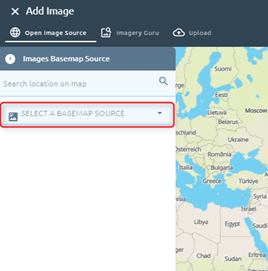
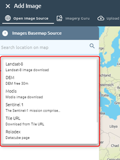

* Sentinel 1

Step 1: Select date, orbit direction:

- Date Range:

  - Select From Date, To Date (From Date < To Date)
  - Select Orbit Direction: Ascending, Descending
- Seasonal Range:

  - Select From Date, To Date (From Date < To Date)
  - Select Years (can choose many)
  - Select Orbit direction

Choose one of two options above

Step 2: Select AOI

There are four ways to select AOI:

- Search location -> Draw AOI on map

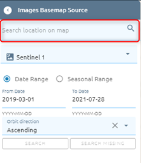

Use Draw tool to draw AOI on map: Click ?? icon -> Select one of four tools by click or use shortcut:

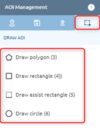

- Select existed AOI in AOI Management: Click ??  icon -> Select one of list AOIs

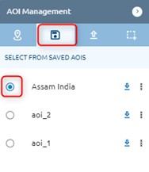

- Upload AOI from PC: Click ?? icon -> Upload file:

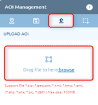

- Select from created region boundary (similar create region of boundary in AOI)

Step 3: Click Search button and select items

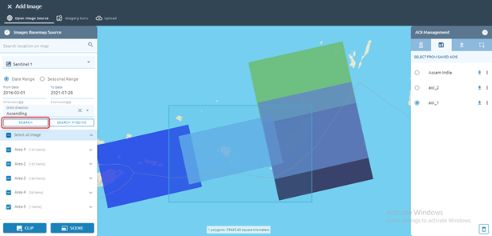

Default: each area chooses one item.

Click the checkbox Select all images to select all images.

Click ?? icon to show all items in that area

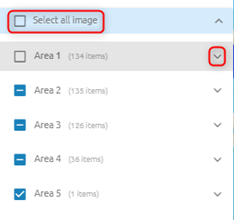

Step 4: Click Clip or Scene

(Clip:) the image will be downloaded and clipped with AOI

(Scene:) Image will be download whole scene

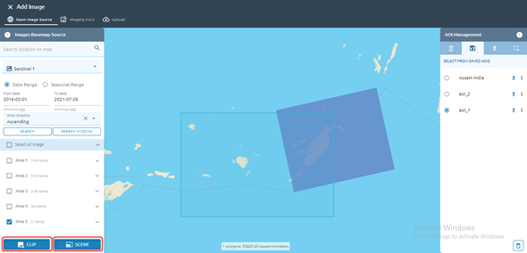

 Step 5: Select product (can choose many), type name

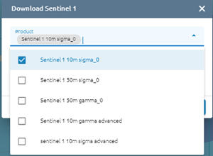
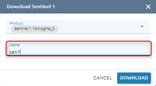

Step 6: Click Download button

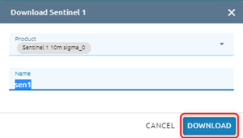

=>  Task will be created in Tasks, wait task success, check result in Imagery

* Sentinel2

Similar to download sentinel 1, but download sentinel 2 does not have orbit direction, it is replaced by Percent cloud.

Step 1: Select date, type percent cloud (default: 40)

Step 2: Select AOI

Step 3: Click Search button and select items

Step 4: Click Clip or Scene (which clip means the image will be downloaded and clipped with AOI. Scene means that Image will be download whole scene)

Step 5: Type name and select option (R10M or R20M, L1C or L2A, Haze Remove or not Haze Remove)

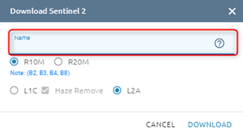

Step 6: Click Download button

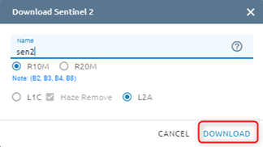

You can choose one, many or all images to download

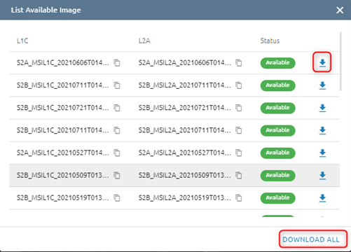

=>  Task will be created in Tasks, wait task success, check result in Imagery

* Landsat-8

Step 1: Select date, type percent cloud (default: 40)

Step 2: Select AOI

Step 3: Click Search button and select items

Step 4: Click Clip or Scene (which clip means the image will be downloaded and clipped with AOI. Scene means that Image will be download whole scene)

Step 5: Type name, select option (Haze remove or not Haze remove, 4 bands or all)

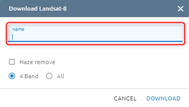

Step 6: Click Download button

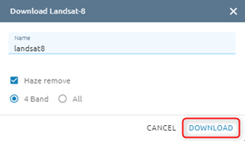

=>  Task will be created in Tasks, wait task success, check result in Imagery

* Bing

With Bing, you just need to choose AOI

Step 1: Select AOI

Step 2: Click Download button

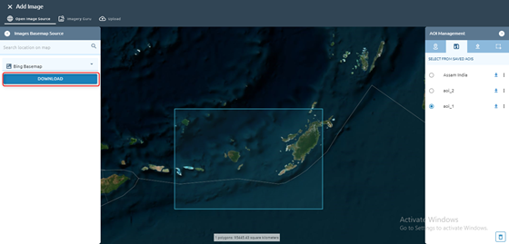

Step 3: Type name -> Click Submit button

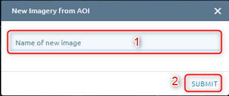

=>  Task will be created in Tasks, wait task success, check result in Imagery

* SRTM (DEM)

Similar to Bing, you just need to choose AOI.

Step 1: Select AOI

Step 2: Click Download button

Step 3: Type name -> Click Submit button

* Rolodex

Step 1: Select type image, date

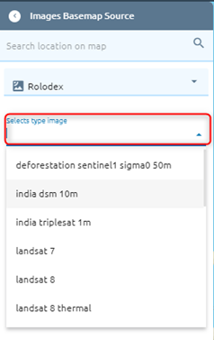

Step 2: Select AOI

Step 3: Click Search button -> Select item(s)

Step 4: Click Clip or Scene

Step 5: Type name, select “Would you like to mosaic?” to mosaic if there are many items (if checked, you can type resolution) 

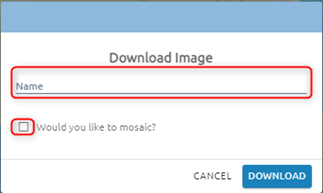
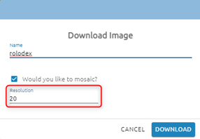

Step 6: Click Download button

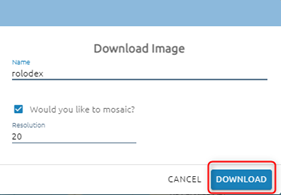

=>  Task will be created in Tasks, wait task success, check result in Imagery

Imagery Guru
============

Download the commercial images

Search
******

Allow users to search images on imagery guru.
	
Step 1: Select AOI

You can search location then draw AOI or select exist AOI. Select date, adjust Cloud coverage, Resolution of images

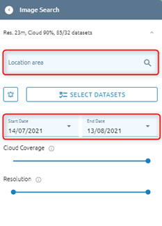

Step 2: Click “Search” button if step 1 is choose exist AOI

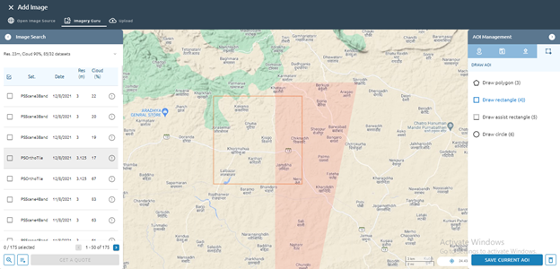

=> Return list images.

Beside, you can also store and manage search results:

Click ?? icon to show the saved search result. Search Management allows you to save current search, load and delete search results in list. 

Click ??  icon to clear selected items.

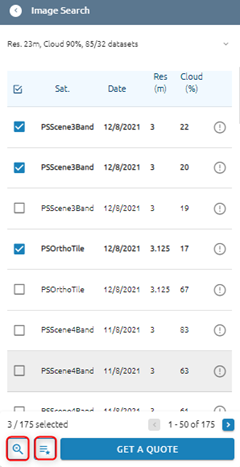
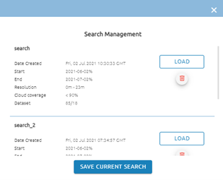

Setting
*******

Allow users to set up an alert to receive an email when new imagery matches the parameters.

Step 1: Click ??  icon

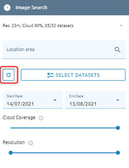
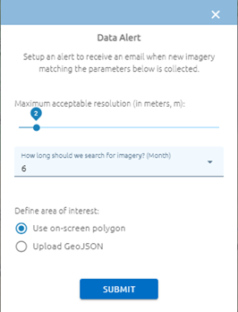

Step 2: Define parameters:

- Maximum acceptable resolution
- How long should we search for imagery?
- Define AOI

Step 3: Click Submit button

Submit a quote
**************

After you choose images, click “Get a quote” button:

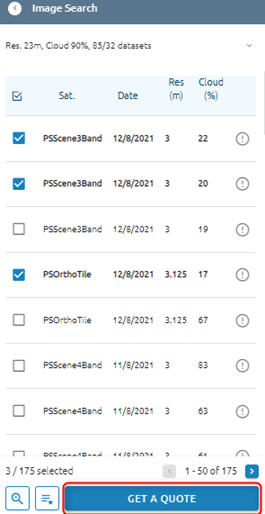

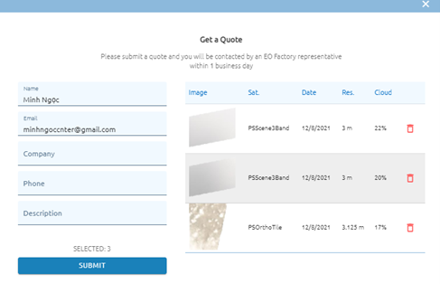

Next check images and type information -> Click Submit button.

=> EO Factory representative will contact with you within 1 business day

Order
*****

Allow users to manage your ordered images. Click Order button

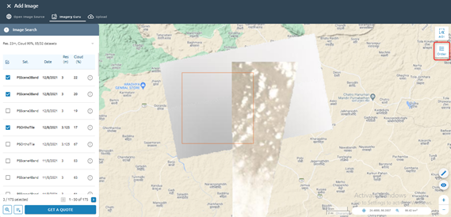

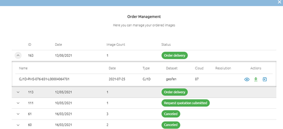

Wait for status is Order delivery, you can click ?? icon to download the image or click ??  icon to import to workspace.

Upload
======

Users want to upload files from the computer. System support file .tiff, .tif, .zip

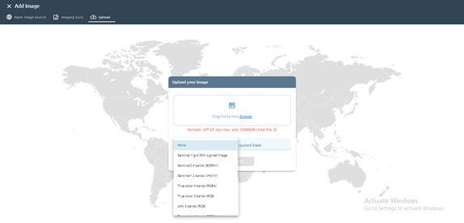

Click Upload File button 

After clicking the button, a task will be created. Task success -> uploaded image successful.

=> Please check at tab My Images.

