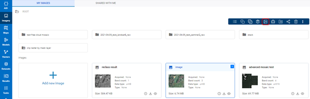
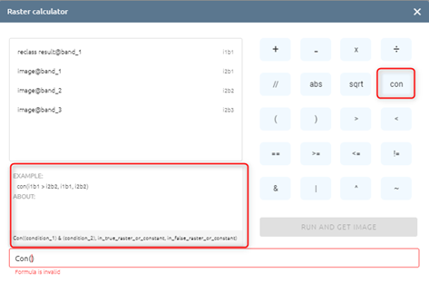
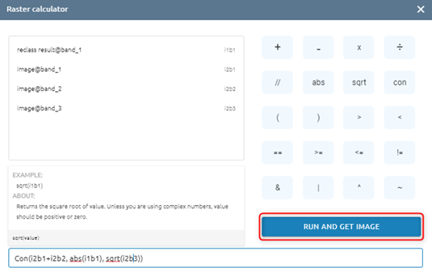
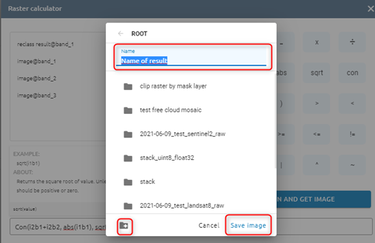

Advance Toolbar
---------------

When users click on one image the advanced toolbar will appear instead of the basic toolbar. There are: copy to, mosaic tool, reclass toolset, raster calculator, tools, move selected images, share selected images and delete selected images. The ?copy to?, ?mosaic tool?, ?reclass toolset?, ?tools?,  ?move selected images?, ?share selected images? and ?delete selected images? are similar above.

Raster Calculator
=================

Raster Calculator is a tool to calculate raster pixel value. (if calculating in more than 2 rasters, they need to be same size matrix and same resolution)

Step 1: Click image -> Click ???  icon on toolbar

Step 2: Start to calculate on image: Select bands, operations.
Correspond to 3 operations: abs (absolute), sqrt (square root), con (conditional), will have suggestion

You can easily use the rest of the operations. 

Step 3: Click Run and get image button 

Step 4: 

* Type name
* Click  to create new folder -> select folder or select folder (skip create) 
* Click Save image button

=> A task will be created in Tasks. Wait for the task to be successful, please check at Imagery with corrections.

