Toolbar for Analysis
--------------------

Basic toolkit: mosaic tool, reclass toolset and tools 

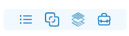

Mosaic Tool 
===========

This tool allows the user to mosaic by manually choosing cutlines between images before mosaicing. 

Click ???  icon on toolbar to start use tool:

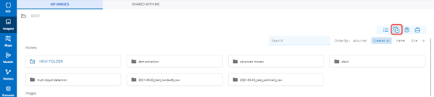

?????

Reclass Toolset
===============

Reclass toolset will reclassify (or change) the value in a raster- a range of value pixels will be reclassified or a single pixel (unique) will be assigned to another value.

You can choose image first, then click   icon or click  icon, then select image.

* Choose image -> Click   icon:

Step 1: Select band (Only one, you can search if there are many bands)

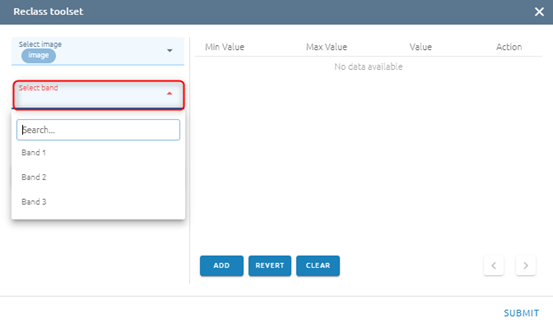

Step 2: Click Classify button

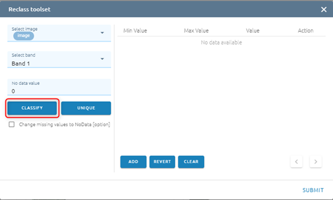

Step 3: Type input:

- Select mode

  -	Standard Deviation: the method shows you how much a feature’s attribute value varies from mean. Class breaks are created with equal value ranges that percentage of the standard deviation using mean value and the standard deviation from the mean
  - Equal interval: the method divides the range of values into equal-sized subranges.
  - Quantile: the method will assign the same number of values to each class. There are no empty classes or classes with too few or too many values. This method works well with the linearly distributed data.
- Type Amount of value (If mode is Standard Deviation, the default Amount of value will be 6)

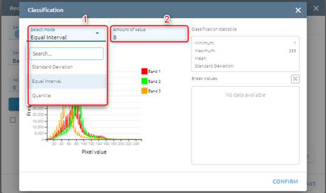

Step 4: Click Classify button

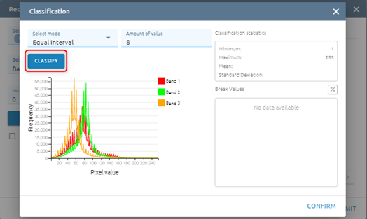

After click Classify button, please see Histogram and Break Values based mode and amount of value

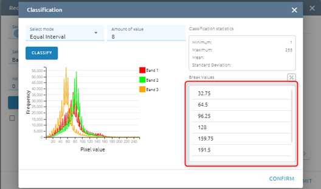

Step 5: Click Confirm button

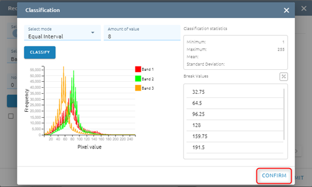

Step 6:

* You  can add Max value - Min value - Value

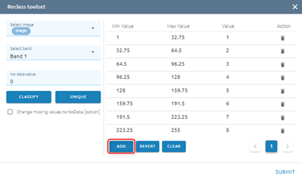

Type new data

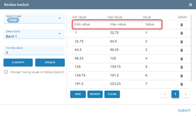

or you can edit by type directly

or delete by click ??? icon

* You can Revert values

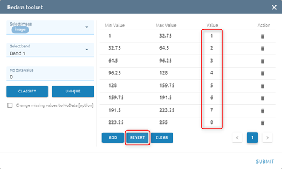
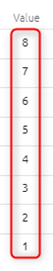

* You can Clear all values

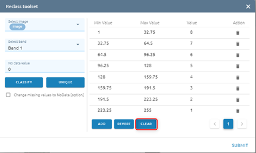

* Default: No data value equal 0. If you want to change No data value, type input directly. And click checkbox if you want to change miss value to No data

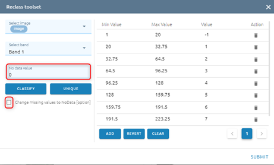

* Click Unique if you want each old value to correspond to a unique new value

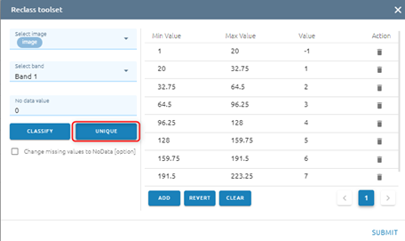

Step 7: Click Submit button

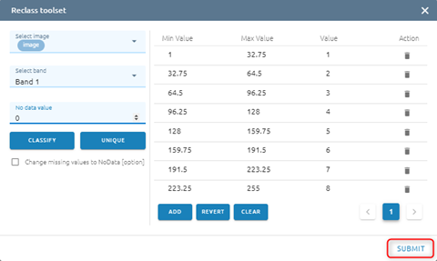

Type name -> Click Confirm button

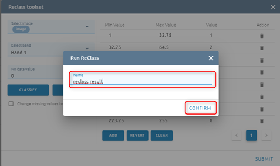

=> Tasks will be created in Tasks. Wait task was successful, please check at Imagery with the correct name.

Tools 
=====

?????
