Tools for Managing Image
------------------------

Information of Image
====================

User want to see information of image

There are three ways:

* Click info icon directly on image:

.. image:: ../img/info_image_1.png
    :align: center 

Show info image popup. If you want see more info, please click Show More Info button

.. image:: ../img/info_image_2.png
.. image:: ../img/info_image_3.png

* Click right mouse on image -> click info button

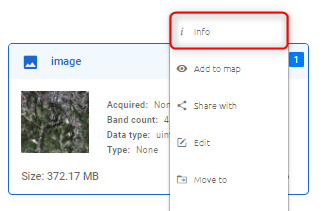

* Click image -> click ???  icon on toolbar -> click Info button

View in Map
===========

Users want to view images on Map.

There are two ways similar to Info:

* Click icon direct on image

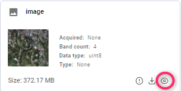

* Click right mouse on image -> click Add to map button

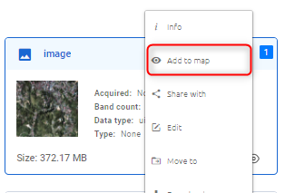

After click icon, page will redirect to Maps

Share
=====

Users want to share images with other users by using their emails. You can share with one or many people.

There are two ways:

* Click  image -> click ???  icon on toolbar

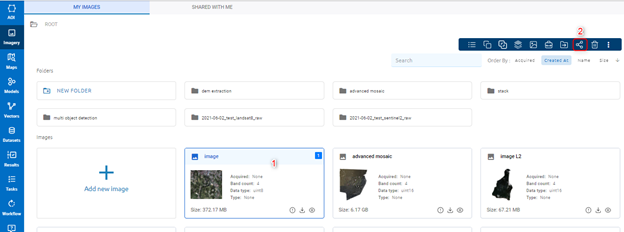

Then a popup appears, please type email -> Click Share button. If you want share to multi email, type one email -> Enter: 

.. image:: ../img/share_image_2.png
.. image:: ../img/share_image_3.png

* Click right mouse on image -> Click Share with button

.. image:: ../img/share_image_4.png
    :align: center 

Then similar to the above way.

Edit
====

Users want to edit images.

There are two ways:

* Click right mouse on image -> Click Edit button

.. image:: ../img/edit_image_1.png
    :align: center 

* Click image -> Click ???  icon -> Click Edit button

.. image:: ../img/edit_image_2.png
    :align: center 

Move
====

Users want to Move image to another folder (or root) in the current workspace.

Click right mouse -> Click Move to button

.. image:: ../img/move_image_1.png
    :align: center 

Select existed folder -> Click Move here button:

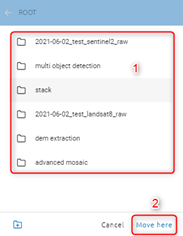

or Create new folder -> Select that folder -> Click Move here button:

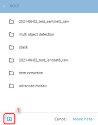
.. image:: ../img/move_image_4.png
.. image:: ../img/move_image_5.png

=> Please open the selected folder to check. 

Download
========

Users want to download images to the computer.

There are three ways similar to Info:

* Click download icon directly on image

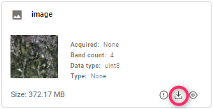

* Click right mouse on image -> click Download button

.. image:: ../img/download_image_2.png
    :align: center 

* Click image -> click ???  icon on toolbar -> click Download button

.. image:: ../img/download_image_3.png
    :align: center 

After download success, file name is image name, file format is .tif.
In addition, images with raw files, such as landsat/ sentinel, users can download raw data by using the Info -> click download icon in image detail. File raw download will be downloaded with format *.zip.

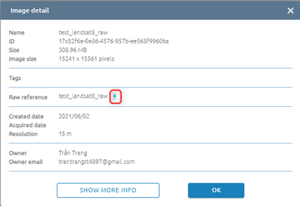

Copy
====

Users want to copy images to other workspaces.

There are two ways:

* Click right mouse -> Click “Copy to” button

.. image:: ../img/copy_image_1.png
    :align: center 

Show list workspace popup -> Select workspace you want to move to -> Click Copy button.

If you want to move to a folder in that workspace, select existing folder (1) or create new folder (1’) -> Select created folder -> Click Copy button.

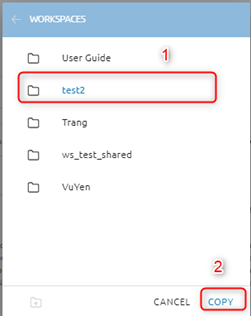
.. image:: ../img/copy_image_3.png

* Click image -> Click ???  icon on image

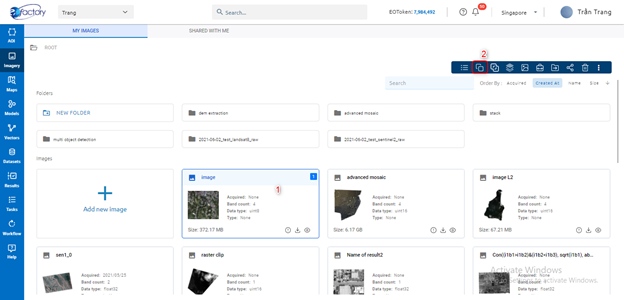

Delete 
======

Users want to delete images.

There are two ways:

* Click image -> click ???  icon on toolbar

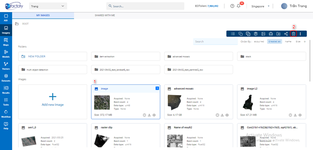

* Click right mouse on image -> click Delete button

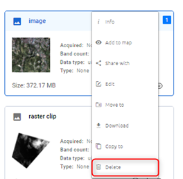
