Map
---

Where all geospatial files are displayed and analyzed. There are 2 main parts: layer control and toolbar.

Layers Control
==============

Where controls and manages displayed layers like raster file or vector file.

Control Tools
*************

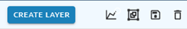

* Create layer: user can create new layer by add new layer or upload from ?AOI layer?, ?Tiles layer?, ?Vector file? or ?Web map service layer?

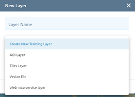

* Time serial: with images which have the data acquired, can be selected to show the chart of time series. 

* Add new group

Click icon to add new group the layers:

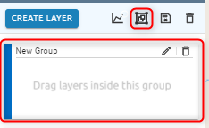

You can drag and drop the layer into the group.

For each group: 

* Click  icon to edit group name
* Click   icon to delete group
* Click checkbox to view all layers in group

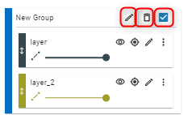

* Save

Click icon to save workspace layer

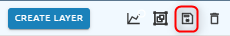

* Delete

Click icon to delete all layers on Layers control

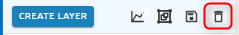

Display Image 
*************

Image will displayed in layer control:

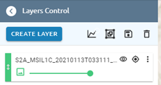

With icon ??? to view or not view the image, the icon ??? to zoom to layer/ image and more option can be discovered by icon ???

* The image added from Imagery will have 5 options: Rename, Properties, Tile Info, Spatial Adjustment

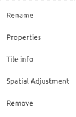

* The raster added from Results will have 3 options: Rename, Labels control, Remove.

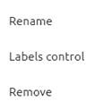

Functions: 

* Rename: allows user change the name of layer
* Properties: will help users to change the display of images manually by using band rendering, min/max value setting and color rendering

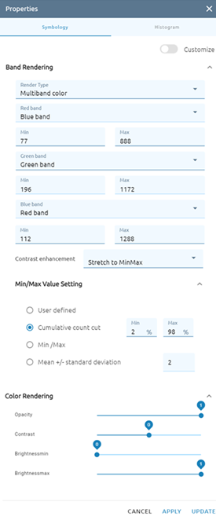

1. With customize function: users can use formulas to display images. 
2. Band rendering: have 4 choices for users: Multiband color/ Color Pallet / Singleband gray/ Singleband pseudocolor.
Multiband color: allows users to have the composition of bands to display the image, three selected bands from the image will be used as the red, green or blue component of the color image. Allow to fetch Min and Max values for each band of the raster and scale the coloring accordingly.
Color pallet: This is the standard render option for singleband files that include a color table, where a certain color is assigned to each pixel value. (using button “classify” by doing automatically or add manually by using the button “Add”)

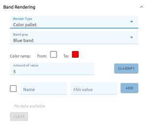

Singleband gray: This renderer allows you to render a single band layer with a color gradient: ‘Black to white’ or ‘White to black’  

Singleband pseudocolor: This is a render option for single-band files that include a continuous palette. with 3 modes: continuous, equal interval and quantile and 3 types of interpolation color: Exact, Discrete, Linear. (using button “classify” by doing automatically or add manually by using the button “Add”)

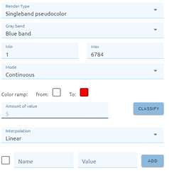

3. A Contrast enhancement method can be applied to the values: ‘No enhancement’, ‘Stretch to MinMax’, ‘Stretch and clip to MinMax’ and ‘Clip to min max’.

* Tile Info: the information of Tile image
* Spatial Adjustment: to adjust an image to another image.
* Remove: remove layer 
* Labels control: to show the labels of results image

Display Vector
**************

Vector can be added from AOI folder, Tile layer, from PC, web map service layer or even create new layer.

* Vector added from the AOI layer by using the control tool “Create Layer” then select the AOI layer, next put the name and select the available AOI. Finally click on “Create layer”

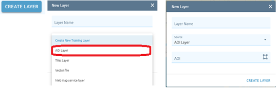

* Vector added from the Tiles layer folder by using the control tool “Create Layer” then select the tile layer, next add the URL and finally click on “Create layer”.

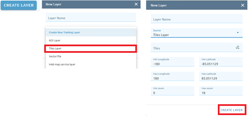

* Vector added from PC by using the control tool “Create Layer” then select the vector layer, next click on File input and select the vector file from PC. Finally click on Create Layer.

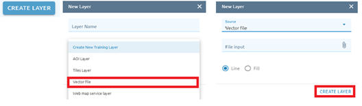

* Vector added from the web map service layer by using the control tool “Create Layer” then select the web map service layer, and fill the information there before clicking on Create Layer.

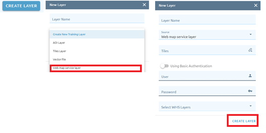

The vectors are added from AOI or PC will have functions by click on icon ??? . There are 10 functions: Rename, Feature size, Style, Convert to vector, filter, table properties, Attribute  table, feature count, remove and download (.geojson).

* Rename: change the name of layer
* Style: change the style like color, opacity and width.
* Add to WMS
* Filter: allows users to define a subset of the features in the layer
* Table properties to see the attribute of layer
* Attribute table to know what type of each attribute of layer, allow to add, delete attribute.
* Feature count: to count the number of features
* Remove: remove layer
* Download: download the layer to the computer with format geojson.

The vectors added from the vectors folder will have 4 functions: Rename, Filter, Style and Remove. The functions are the same above. 

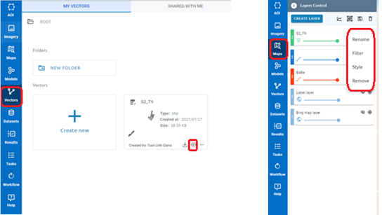

Toolbar
=======

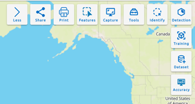

Share
*****

Allow users to share maps for other users by link.

Step 1: Create map

Step 2: Click Share button

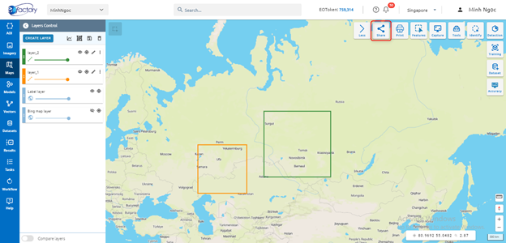

Step 3: Create link

Type link and description

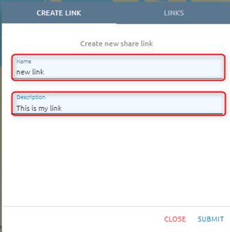

Step 4: Click Submit button

After submitting a link, the link will be created at tab Links. Click tab Links to check.

Step 5: Copy link and send to other users

Click ???  icon to copy link:

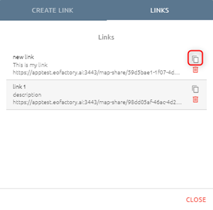

Print
*****

Step 1: Click Print button:

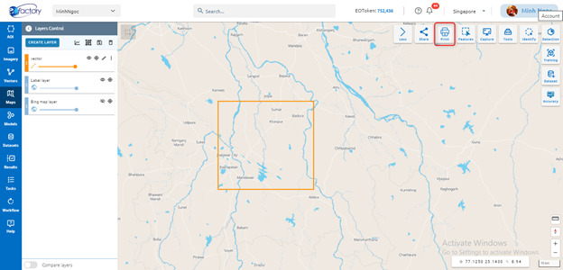

Step 2: Type input before print:

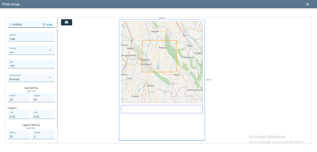

Step 3: Click ???  icon

Enter the parameters:

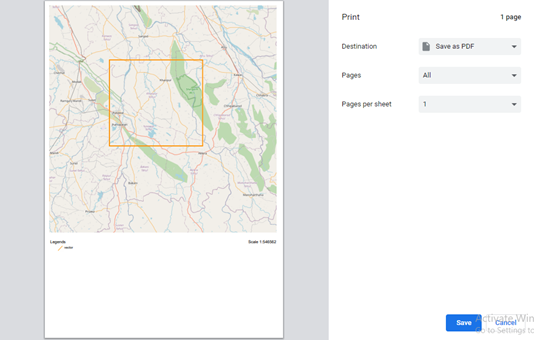

Step 4: Click Save button 

Capture
*******

Allow users to take screenshots of the map at that time.

Click Capture button:

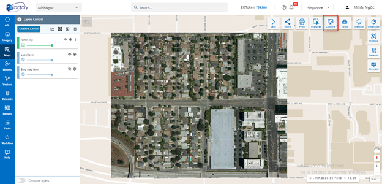

Tools
*****

???

Identify
********

Allow to view attribute value for a feature or pixel value for each band of image.

Click Identify button:

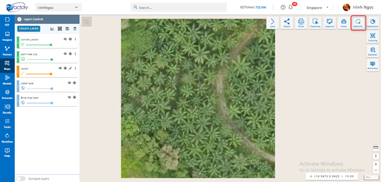

Click on a feature or point image to show value.

Training
********

* Step 1: Click “Training” button in Maps

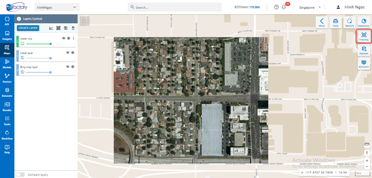

* Step 2: Type input

1. Training model name
2. Select 1 of 4 types:
3. Each type will have the config to adjust the model with data. 
4. Click Continue button
5. Select image: select image which you want to train

Type name into search input to search image -> Click image. 
Click  ??? icon to add image to map.

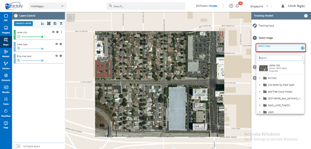

6. Click Continue button
7. Training area layer: select exist layer or draw new one

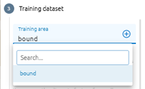

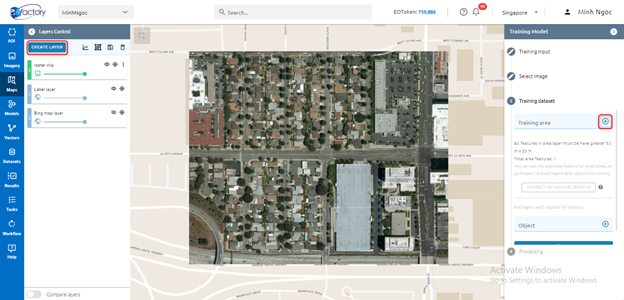

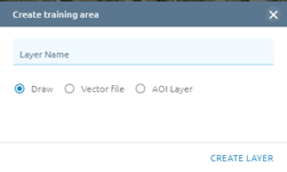

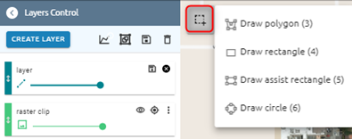

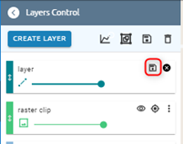

* Step 3: Click Run button

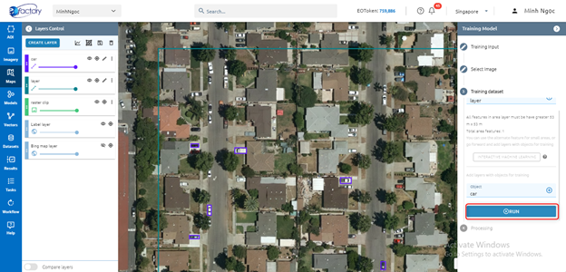

System creates tasks that train models. When the Task is successful, you will see your model in the Model Menu

Detection
*********

* Step 1: Click Detection button in Maps

* Step 2: Select input
1. Select image you want to detect
2. Select model you want to use

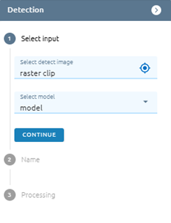

* Step 3: Click Continue button
* Step 4: Type name
* Step 5: Click Run button

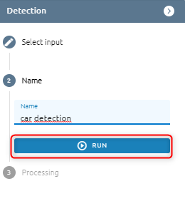

System creates tasks that detect objects. When a Task is successful, you will see your result in the Result Menu.

Dataset 
*******

Allow users to create training dataset.

For Object detection: only select an annotation. As for Classification detection: select many annotations.

Step 1: Click Dataset button

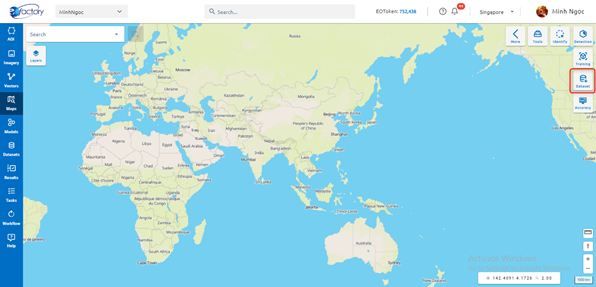

Step 2: Type input

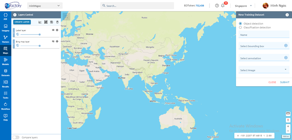

Step 3: Click Submit button

Accuracy
********

Allow users to check accuracy of model

* Step 1: Click Accuracy button

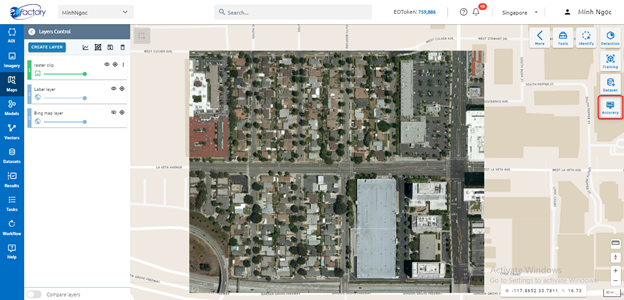

* Step 2: Type accurate report input

1. Type report name
2. Select model
3. Select image

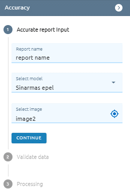

* Step 3: Click Continue button
* Step 4: Validate data: Select exist layer or create new one

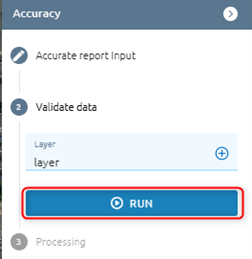

* Step 5: Click Run button
After clicking, a task will be created. When a task is successful, check the result in the menu Model. 
* Step 6: Check result in Models: Model detail of selected model -> Tab Accurate Report

