Toolbar
-------

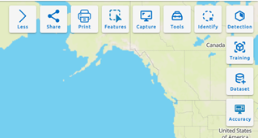

Share
=====

Allow users to share maps for other users by link.

Step 1: Create map

Step 2: Click Share button

.. image:: ../img/map_share_1.png
    :align: center

Step 3: Create link

Type link and description

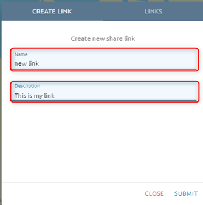

Step 4: Click Submit button

After submitting a link, the link will be created at tab Links. Click tab Links to check.

Step 5: Copy link and send to other users

Click ???  icon to copy link:

.. image:: ../img/map_share_3.png
    :align: center

Print
=====

Step 1: Click Print button:

.. image:: ../img/map_print_1.png
    :align: center

Step 2: Type input before print:

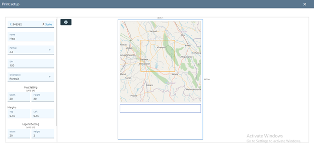

Step 3: Click ???  icon

Enter the parameters:

.. image:: ../img/map_print_3.png
    :align: center

Step 4: Click Save button 

Capture
=======

Allow users to take screenshots of the map at that time.

Click Capture button:

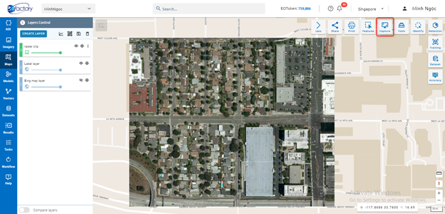

Tools
=====

???

Identify
=========

Allow to view attribute value for a feature or pixel value for each band of image.

Click Identify button:

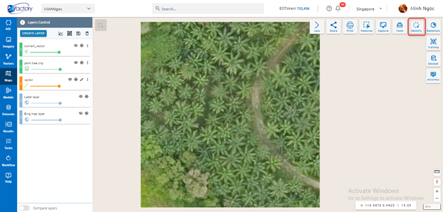

Click on a feature or point image to show value.

Training
========

* Step 1: Click “Training” button in Maps

.. image:: ../img/map_training_1.png
    :align: center

* Step 2: Type input

1. Training model name
2. Select 1 of 4 types:
3. Each type will have the config to adjust the model with data. 
4. Click Continue button
5. Select image: select image which you want to train

Type name into search input to search image -> Click image. 
Click  ??? icon to add image to map.

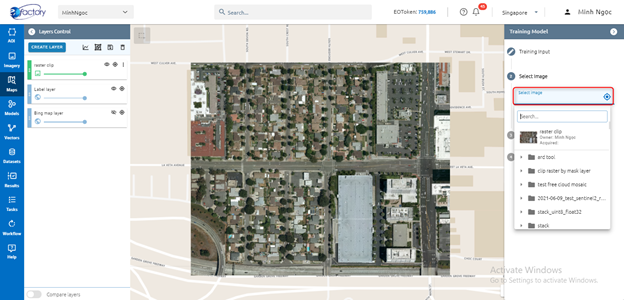

6. Click Continue button
7. Training area layer: select exist layer or draw new one

.. image:: ../img/map_training_3.png
    :align: center

.. image:: ../img/map_training_4.png
    :align: center

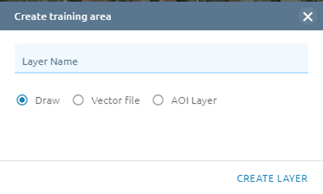

.. image:: ../img/map_training_6.png
    :align: center

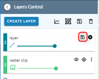

* Step 3: Click Run button

.. image:: ../img/map_training_8.png
    :align: center

System creates tasks that train models. When the Task is successful, you will see your model in the Model Menu

Detection
=========

* Step 1: Click Detection button in Maps

.. image:: ../img/map_detection_1.png
    :align: center

* Step 2: Select input
1. Select image you want to detect
2. Select model you want to use

.. image:: ../img/map_detection_2.png
    :align: center

* Step 3: Click Continue button
* Step 4: Type name
* Step 5: Click Run button

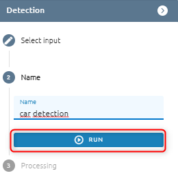

System creates tasks that detect objects. When a Task is successful, you will see your result in the Result Menu.

Dataset 
=======

Allow users to create training dataset.

For Object detection: only select an annotation. As for Classification detection: select many annotations.

Step 1: Click Dataset button

.. image:: ../img/map_dataset_1.png
    :align: center

Step 2: Type input

.. image:: ../img/map_dataset_2.png
    :align: center

Step 3: Click Submit button

Accuracy
========

Allow users to check accuracy of model

* Step 1: Click Accuracy button

.. image:: ../img/map_accuracy_1.png
    :align: center

* Step 2: Type accurate report input

1. Type report name
2. Select model
3. Select image

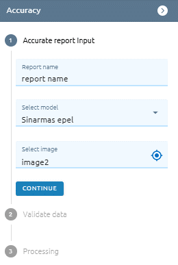

* Step 3: Click Continue button
* Step 4: Validate data: Select exist layer or create new one

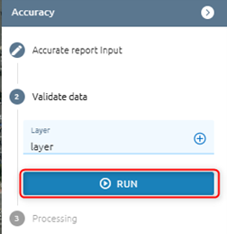

* Step 5: Click Run button
After clicking, a task will be created. When a task is successful, check the result in the menu Model. 
* Step 6: Check result in Models: Model detail of selected model -> Tab Accurate Report

