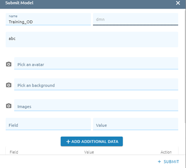
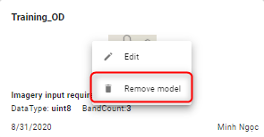

Model
------

Where storing and managing the models. Moreover, users can publicize their own model to the Community. 

My Models
=========

Model Detail
************
Step 1: Click right mouse on model -> Click Model detail. 

There are two tabs: Detail model and Accurate report:

* Detail model

* Accurate report

Click ???  icon to show report detail
Click ??? icon to delete report

Copy to 
*******

Allow users to copy the model to another workspace.
	
Step 1: Click right mouse on model -> Click Copy to button
	
Step 2: Select workspace which you want to copy to.

Step 3: Select the existing folder or create a new folder or copy to root.

Step 4: Click the Copy button.

Submit Model 
************

Allow users to submit the model to the community page.
	
Step 1: Click right mouse on model -> Click Submit model button

Step 2: Type input:
	
(1): Type model name

(2): Type sku

(3): Type description model
	
(4): Select image from PC to make avatar

(5): Select image from PC to make background model

(6): Select minimum 3 file images from PC to make slide
	
(7): Type field-value -> Click Add Additional data to add data

Step 3: Click Submit button

After approve, check at tab Community models

Delete
******

Allow users to delete models.
	
Step 1: Click right mouse -> Click Delete button

Step 2: Click the Confirm button to delete.

Edit
****

Allow users to edit the model with: name, description, thumbnail, tag.
	
Step 1: Click right mouse on model -> Click Edit model button.

Step 2: Type input:

(1): Type new name model
	
(2): Type description of model
	
(3): Select image from PC to make thumbnail

(4): Type tag -> Enter

Step 3: Click Update button

Share 
*****

Allow users to share the model with other users by email.

Step 1: Click right mouse on model -> Click Share with button

Step 2: Type email(s)

Step 3: Click Share button

Shared model will be at tab Shared with me of shared users.

Move to 
*******

Allow users to move the model to other folders.
	
Step 1: Click right mouse on model -> Click Move to button

Step 2: Select folder or create new folder (click ??? icon) or move to root

Step 3: Click the Move button(Click selected folder to check).

Shared with me
==============

Allow users to store and manage shared models.

Remove
******

Step 1: Click right mouse on model -> Click Remove button

Step 2: Click Confirm button

Make copy 
*********

Step 1: Click right mouse on model -> Click Make copy button

Step 2: Type model name

Step 3: Click Submit button

Community Models
================

Where storing public models.

Click tab Community Models:

Click “Go to marketplace” button to know detail (or access https://community.eofactory.ai directly):

Submitted Community Models
==========================

Where storing and managing submitted community models.

Click tab Submitted Community Models:

.. image:: ./img/submitted_model_1.png

Edit 
****

Step 1: Click right mouse on model -> Click edit button

.. image:: ./img/edit_submitted_model_1.png

Step 2: Type model information

Step 3: Click Submit button

Remove 
******

Step 1: Click right mouse on model -> Click “Remove model” button

Step 2: Click Confirm button to delete