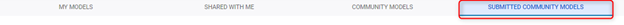
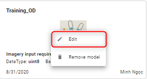
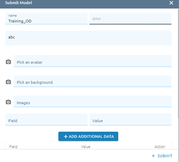
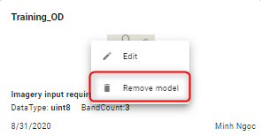

Submitted Community Models
--------------------------

Where storing and managing submitted community models.

Click tab Submitted Community Models:

Edit 
====

Step 1: Click right mouse on model -> Click edit button

Step 2: Type model information

Step 3: Click Submit button

Remove 
======

Step 1: Click right mouse on model -> Click “Remove model” button

Step 2: Click Confirm button to delete