Vector
------

Vectors where store and manage the images and the vector results. Also in Vectors, users can upload vectors from the PC. Besides storing and managing vectors, it provides the toolkits to let users analyse the vector files.

My Vectors
==========

Store and manage your own vectors.

This is action list of vector:

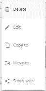

Create 
******

Step 1: Click “Create new”:

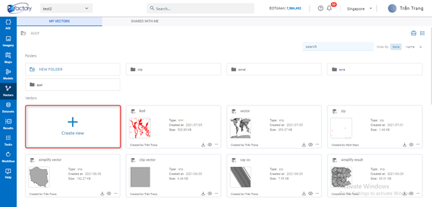

Step 2: Upload file 

You can click file upload area -> choose file or drag and drop file into file upload area:

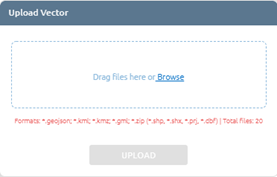
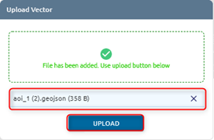

Step 3: Click Upload button

After clicking button, a task will be created, wait task success and check in the menu Vectors

Download
********

Click ??? icon to download vector

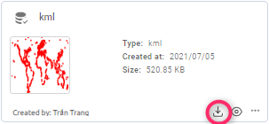

View in Map 
***********

Click ??? icon to show vector in map

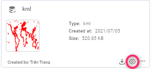

Edit
****

Step 1: Click   icon to show action list

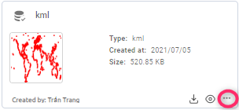

Step 2: Click Edit button in action list

Step 3: Type new name

Step 4: Click Confirm button

Copy 
****

Step 1: Click   icon to show action list

Step 2: Click Copy to button in action list

Step 3: If you want to copy to new folder, click ???  icon -> type folder name to create a new folder, then click the folder which you want to copy to.

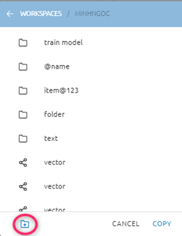

Step 4: Click Copy button

Move
****

Similar to Copy to.

Share 
*****

You can share vector to one or multiple other users with email 

Step 1: Click   icon to show action list

Step 2: Click Share with button in action list

Step 3: Enter email to email is in pending list (can delete if you want)

Step 4: Click Share button

Vector will be in tab Shared with me of shared email

Delete
******

Step 1: Click   icon to show action list

Step 2: Click Delete button in action list

Step 3: Click Confirm button

Shared with me
==============

Where storing and managing shared vectors. You can search the folder, vector by name or order by date, name.

Click the tab Shared with me to start.

Make copy 
*********

Click ???  icon on vector -> Click Confirm button. Copied vector named: name + “copy”

Delete 
******

Click ??? icon -> Click Confirm button

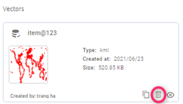

View in Map
***********

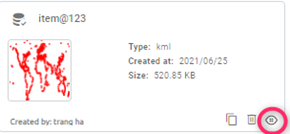

Tools
=====

Buffer
******

This algorithm computes a buffer area for all the features in an input layer, using a fixed or dynamic distance. The segments parameter controls the number of line segments to use to approximate a quarter circle when creating rounded offsets. The end cap style parameter controls how line endings are handled in the buffer. The join style parameter specifies whether round, miter or beveled joins should be used when offsetting corners in a line.The miter limit parameter is only applicable for miter join styles, and controls the maximum distance from the offset curve to use when creating a mitered join.

Step 1: Type input:

(1): Type name

(2): Select vector from vectors list

(3): Type Distance (default: 100m)

(4): Type  Resolution

(5): Type Quadsegs which controls the number of line segments to use to approximate a quarter circle when creating rounded offsets.

(6): Select Cap style (default: round): controls how line endings are handled in the buffer.

(7): Select Join style (default: round): Specifies whether round, miter or beveled joins should be used when offsetting corners in a line

(8): Type Mitre limit (default: 5): Controls the maximum distance from the offset curve to use when creating a mitered join (only applicable for miter join styles). Minimum: 1.

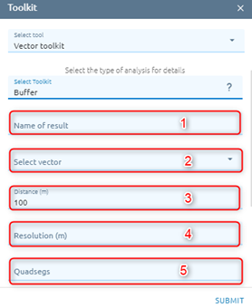
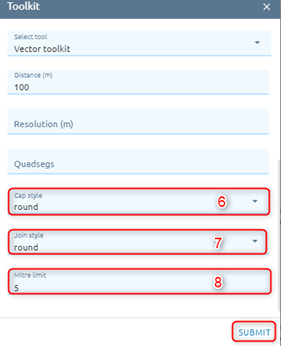

Step 2: Click “Submit” button

Centroid
********

Creates a new point layer, with points representing the centroids of the geometries of the input layer.

Step 1: Type input:

(1): Type name

(2): Select vector from vectors list

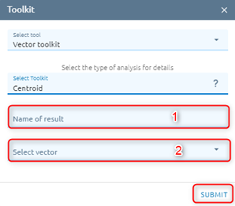

Step 2: Click “Submit” button

Rectify
*******

A method that approximates the prediction pixels into polygons making decisions based on the whole prediction feature space

Step 1: Type input:

(1): Type  name

(2): Select vector from vectors list

(3): Type Resolution

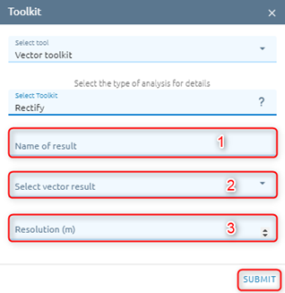

Step 2: Click “Submit” button

Row detection
*************

Row detection is performed automatically for straight and curved rows. The detected rows are used in many applications.

Step 1: Type input

(1): Type name

(2): Select vector from vectors list

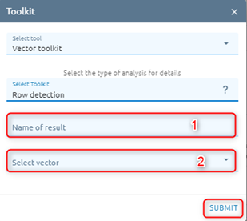

Step 2: Click “Submit” button

Simplify
********

Simplifies the geometries in a line or polygon layer. It creates a new layer with the same features as the ones in the input layer, but with geometries containing a lower number of vertices.

Step 1: Type input

(1): Type name

(2): Select vector from vectors list

(3): Type Tolerance : if the distance between two nodes is smaller than the tolerance value, the segment will be simplified and vertices will be removed.

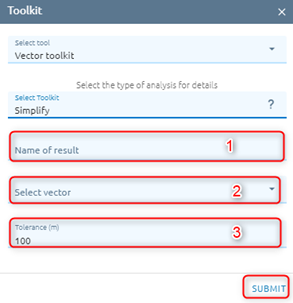

Step 2: Click “Submit” button

Vector Clip
***********

This algorithm clips a vector layer using the features of an additional polygon layer. Only the parts of the features in the Input layer that fall within the polygons of the Overlay layer will be added to the resulting layer.

Step 1: Type input

(1): Type name

(2): Select vector from vectors list

(3): Select AOI from AOIs list

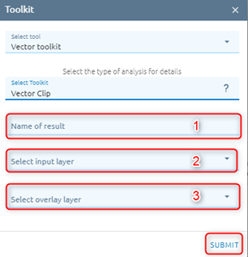

Step 2: Click “Submit” button