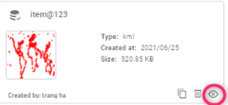

Shared with me
--------------

Where storing and managing shared vectors. You can search the folder, vector by name or order by date, name.

Click the tab Shared with me to start.

Make copy 
=========

Click ???  icon on vector -> Click Confirm button. Copied vector named: name + “copy”

Delete 
======

Click ??? icon -> Click Confirm button

.. image:: ../img/swm_delete_vector.png
    :align: center 

View in Map
===========

