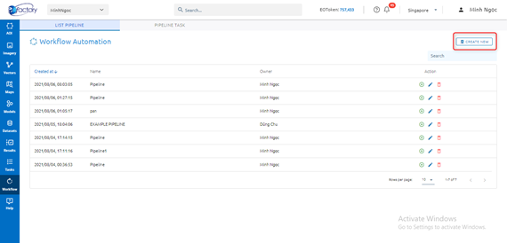
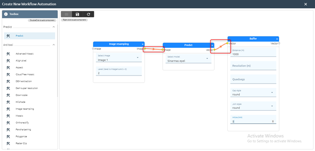
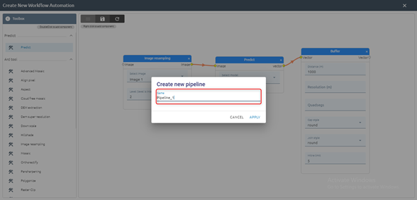
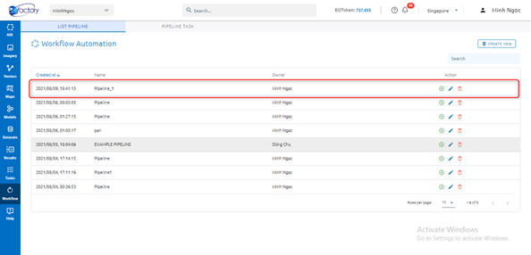
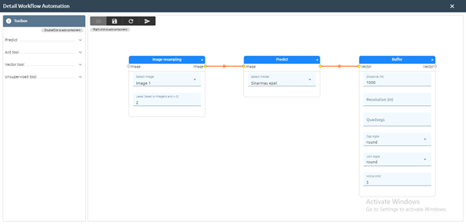
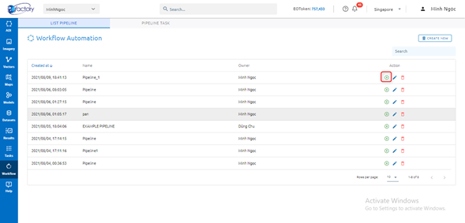
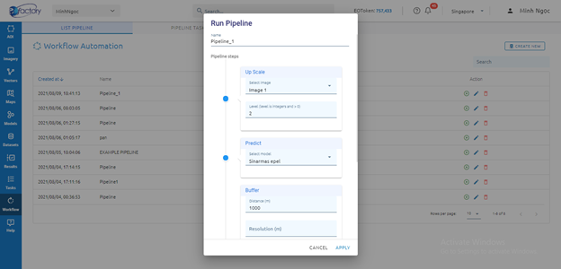
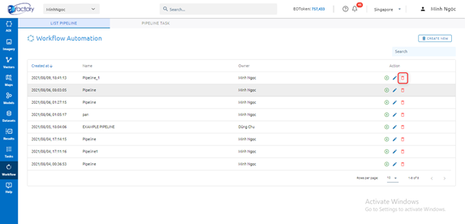
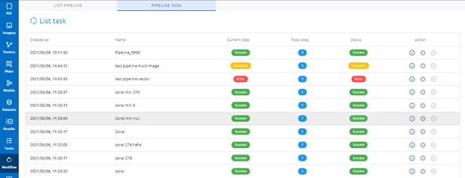

Workflow
--------

Where helping users to run a workflow with a combination of many tasks.

Create 
======

Step 1: Click Create new button

Step 2: Select tools: Double click tool to select -> Use the mouse to connect the output point of the first tool to the input point of the next tool.

Step 3: Click ???  icon to save pipeline or ???  icon to refresh.
	
Step 4: Type pipeline name -> Click Apply button

=> Pipeline is created.

Edit
====

Step 1: Click ???  icon

Step 2: Edit data

Step 3: Click ???  icon to save or ???  to run directly 

Step 4: Type new name

Step 5: Click Apply button  

Run 
===

You can run like step 3 of item 9.2 or click ??? icon

Click Apply button

Wait task success at tab Pipeline Task

Delete
======

Click ??? icon

Click the Delete button to confirm.

Pipeline Task 
=============

Store pipeline tasks. At Current step, you will know which tool is running. 

Click ??? icon to show info task.
Click ???  icon to cancel the task when the task is running.
Click ??? icon to continue task when fully loaded token (task will be paused when not enough token)
